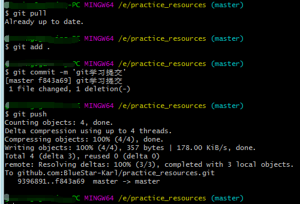

## 知识基础

### 什么是git？
git是**版本控制器**，简单的说，我昨天写的代码是1.0版本，今天写的代码是2.0版本，我可以通过git随时找到不同版本的代码。比如我要上线1.0版本的代码，我就通过git找到昨天的代码，并部署到服务器。此外，我还想使用2.0版本中的一个功能，我就用git把当前代码还原到今天的，把功能代码提取出来使用。两个版本通过git切换，相互之间不受影响，各自独立。

### 什么是github？
github是**远程版本仓库**，记住，是远程的。当然，还有本地的，只要在本地初始化，本地就自动创建本地版本仓库。我们把代码存放到github上，让他帮我们保管代码，以防本地机器出现问题，导致代码丢失。github还是一个开源社区，通过GitHub，既可以让别人参与你的开源项目，也可以参与别人的开源项目。要是不想让别人看到你的代码，请设置为私有的，但是，私有是收费的。公司的代码不需要你担心。

## 使用git

### 安装
从官网安装git程序，安装完成后，在开始菜单里找到“Git”->“Git Bash”，蹦出一个类似命令行窗口的东西，就说明Git安装成功。  
安装完成后，还需要最后一步设置，在命令行输入：  
```
$ git config --global user.name "Your Name"
$ git config --global user.email "Your Email"
```  

### 初始化
我们新建一个文件夹，这个文件夹就是我们的项目源码。通过git init命令把这个目录变成Git可以管理的仓库，也就是本地仓库。  
```
git init
```

### 创建SSH Key
```
ssh-keygen -t rsa -C "youremail@example.com"
```
如果一切顺利的话，可以在用户主目录里找到.ssh目录，里面有id_rsa和id_rsa.pub两个文件，这两个就是SSH Key的秘钥对，id_rsa是私钥，不能泄露出去，id_rsa.pub是公钥，可以放心地告诉任何人。  

### 获取代码
1. 建立远程仓库，将本地仓库推送到远程 --- 第一种方法  
这种方式常见于自己的私有项目，原因很简单，公司的项目已经在Github上存有项目代码了，你只要拉取代码就可以了。自己的项目一般会先写代码，然后放到Github上托管代码，比如上面初始化的仓库，这个时候需要建立本地仓库和远程仓库的联系，然后推送代码。
首先你要在github上建立一个项目，并把上面创建的SSH Key**公钥**放到项目的Key中，然后建立远程仓库和本地仓库的联系。   
```
//建立远程仓库和本地仓库的联系  
git remote add origin [Your GitHub 仓库地址]
```  
（具体如何在github上创建项目并添加SSH Key，看廖雪峰的网站介绍，很详细）  

2. 从远程仓库克隆代码到本地 --- 第二种方法，最常用  
同样需要你的领导将你的SSH Key**公钥**放到项目的Key中，然后，通过克隆命令，将远程代码克隆到本地，你就拥有了一份和GitHub上一模一样的代码。
```
//克隆代码
git clone [git地址]
```

### 提交代码
上面我们已经拥有了一份公司代码，并做了一些开发，现在把这些文件推送到远程。  
下面我会写一些概念，仔细记一下。  
首先，先更新一下代码，因为你的同事也在更新代码，你需要从远程仓库更新你本地的代码。  
```
//从远程仓库拉取代码，更新工作区代码
git pull
```
然后，我们在**工作区**代码进行修改，本地就是工作区。  
我们通过git命令将修改，添加到**暂存区**
```
git add [文件名]
```
之后，我们将**暂存区**代码，提交到**本地仓库**
```
git commit -m [对本次提交的描述]
```
最后，我们将**本地仓库**的代码，推送到**远程仓库**
```
git push
```
(对项目的第一次克隆和提交，git会有一些警告，没有关系，看不懂忽略就好，一直回车)  
简而言之，提交代码，四个步骤：
```
git pull
git add [文件名]
git commit -m [对本次提交的描述]
git push
```


>  **工作区**  ->  git add [文件名]  ->  **暂存区**  ->  git commit -m [对本次提交的描述]  ->  **本地仓库**  -> git push -> **远程仓库**  
讲到这里，git的基本用法和操作就结束了，常用的就是这些命令，剩下是一些补充，工作中可能会遇到  

### 版本回退
```
git checkout index.html     //add之后，回退
git reset HEAD index.html   //commit之后，回退
git reset --hard HEAD^       //push之后，版本回退
```

### 分支管理
```
git branch dev              //创建分支  
git checkout dev            //切换分支
git checkout -b dev         //创建并切换
git branch -d dev           //删除分支
git commit -a -m 'dev1'     //在分支上提交新的版本
git merge dev               //合并分支
```

我们从GitHub仓库上克隆代码到本地后，一般不会在原有的主干上修改代码，会创建属于自己的分支。  
```
//创建 dev分支并切换到dev分支上
git checkout -b dev
```
然后在这个分支上进行开发，并进行代码管理，git add . ，git commit -m 等。  
当我们开发结束之后，我们会切换到主干（master）上，并将dev分支合并到master主干上。记住，开发是在dev分支上，先切换到master主干上，再将dev分支合并到master主干。

```
//切换到master主干，再合并dev分支到主干上
git checkout master
git merge dev
//删除dev分支
git branch -d dev 
//之后在主干的操作和开发时一样，add，commit等
git add [文件名]
git commit -m [对本次提交的描述]
git push
```

## 结束（其余的冲突处理、tag标签之类的，工作中慢慢接触）